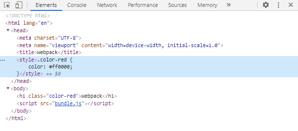

# Webpack

webpack 是一个现代 JavaScript 应用程序的静态模块打包器。

## 1. 快速上手

### 安装

首先，创建项目并初始化 NPM（如果需要）：

```bash
npm init -y
```

本地安装 webpack（推荐）：

```bash
npm install --save-dev webpack
# 或指定版本
npm install --save-dev webpack@<version>
```

webpack 4+，需要安装 `webpack-cli`：

```
npm install --save-dev webpack-cli
```


### 配置

首先创建目录及文件。

创建 `index.html`：

```html
<!DOCTYPE html>
<html lang="en">
<head>
  <meta charset="UTF-8">
  <meta name="viewport" content="width=device-width, initial-scale=1.0">
  <title>Webpack</title>
</head>
<body>
    
  <script src="./src/index.js"></script>
</body>
</html>
```

创建 `src` 目录，并创建 `src/index.js` 文件：

```js
console.log('Hello Webpack')
```

创建配置文件 `webpack.config.js`：

```js
const path = require('path')

module.exports = {
  entry: './src/index.js',
  output: {
    filename: 'bundle.js',
    path: path.resolve(__dirname, 'dist')
  },
  mode: 'development'
}
```

`entry` 配置入口起点，`output` 配置输出路径以及输出文件名，`mode` 是 webpack 4+ 针对目标环境的模式，可选值为 `'development' | 'production' | none`。


### 运行

在 `packjage.json` 的 `scripts` 中配置运行命令：

```json
  "scripts": {
    "build": "webpack"
  }
```

运行命令：

```bash
npm run build
```

编译后生成了 `dist` 目录，以及 `dist/bundle.js` 文件。

替换 `index.html` 中的引用的脚本文件，并在浏览器中打开，打开调试器，正常运行。

```html
<!DOCTYPE html>
<html lang="en">
<head>
  <meta charset="UTF-8">
  <meta name="viewport" content="width=device-width, initial-scale=1.0">
  <title>Webpack</title>
</head>
<body>
    
  <script src="./dist/bundle.js"></script>
</body>
</html>
```


## 2. modules 和 loader

webpack默认只支持编译 js 模块，而通过 loader，webpack 可以支持各种语言和预处理器编写模块。

> 使用 loader 解析文件之前，请先查看 plugins-HtmlWebpackPlugin 部分，并使用 `html-webpack-plugin` 插件。


### 加载 css

安装 `style-loader` 和 `css-loader`：

```bash
npm install --save-dev style-loader css-loader
```

修改 `webpack.config.js`：

```diff
  const path = require('path')
  const HtmlWebpackPlugin = require('html-webpack-plugin')

  module.exports = {
    entry: './src/index.js',
    output: {
      filename: 'bundle.js',
      path: path.resolve(__dirname, 'dist')
    },
+   module: {
+     rules: [
+       {
+         test: /\.css$/,
+         use: ['style-loader', 'css-loader']
+       }
+     ]
+   },
    plugins: [
      new HtmlWebpackPlugin({
        template: 'index.html', // 用于编译的模板文件
        filename: 'index.html'  // 编译后输出的文件名
      })
    ],
    mode: 'development'
  }
```

> loader 的加载顺序是从后往前，而 `style-loader` 基于 `css-loader` ，所以 `css-loader` 需要写在 `style-laoder` 后面。

添加样式文件 `src/style.css`：

```css
.color-red {
  color: #ff0000;
}
```

修改 `index.html`：

```html
<body>
  <h1 class="color-red">Webpack</h1>
</body>
```

在 `src/index.js` 中导入样式：

```diff
+ import './style.css'

  console.log('Hello Webpack')
```

运行 `npm run build`，编译后打开 `dist/index.html`，打开后样式表被加载。如果打开调试器，能够看到在 `<head>` 标签里边注入了样式。



> 优化：使用 `MiniCssExtractPlugin` 分离 css 文件，参考后面 `plugins` 。


### less/scss

以 less 为例，配置 css 预处理器对应的 loader

首先，安装对应的预处理器和 loader：

```sh
npm install --save-dev less@3.0.4 less-loader@5.0.0
```

建议安装 `less-loader` 时指定版本，高版本可能报错

修改 webpack 配置文件：

```diff
  module.exports = {
    module: {
      rules: [
        {
          test: /\.css$/,
          use: ['style-loader','css-loader']
        },
+       {
+         test: /\.less$/,
+         use: [
+           'style-loader',
+           'css-loader',
+           'less-loader'
+         ]
+       }
      ]
    }
  }
```

添加样式文件 `src/style.less`，使用嵌套语法：

```css
h1 {
  &.color-green {
    color: #00ff00;
  }
}
```

修改 `index.html`：

```html
<body>
  <h1 class="color-red">Webpack</h1>
  <h1 class="color-green">less</h1>
</body>
```

在 `src/index.js` 中导入样式：

```js
import './style.css'
import './style.less'
```

> 优化：使用 `MiniCssExtractPlugin` 分离 css 文件，参考后面 `plugins`


### postcss（autoprefixer）

为了使 css 兼容不同的浏览器，需要通过 `postcss` 来自动添加产商前缀。

首先，安装相关依赖：

```sh
npm install --save-dev postcss postcss-loader postcss-preset-env
```

> `post-preset-env` 中包含了 `autoprefixer` ，不需要额外安装。

修改 webpack 配置文件：

```diff
  module.exports = {
    module: {
      rules: [
        {
          test: /\.css$/,
          use: ['style-loader','css-loader']
        },
        {
          test: /\.less$/,
          use: [
            'style-loader',
            'css-loader',
+           'postcss-loader'
            'less-loader'
          ]
        }
      ]
    }
  }
```

`postcss-loader` 需要在 `css-loader` 之前调用，预处理器的加载器之后调用，由于 webpack 加载器是从后往前调用，因此 `postcss-loader` 的书写位置在 `css-loader` 之后，预处理器的加载器之前。

新增 `postcss.config.js` 配置文件：

```js
module.exports = {
  plugins: [
    'postcss-preset-env'
  ]
}
```

修改 `package.json` ，通过 `browserslist` 设置兼容的浏览器：

```json
{
  "browserslist": [
    "> 1%",
    "last 2 versions",
    "not ie <= 8"
  ]
}
```

修改样式文件：

```diff
  .color-red {
    color: #ff0000;
+   transform: scale(1.1);
  }
```

重新编译项目，编译后的样式为 `transform` 添加了 `-webkit-` 前缀。

`postcss-loader` 的更多用法参考： [postcss-loader | webpack 中文文档](https://webpack.docschina.org/loaders/postcss-loader/) 。


### 图片

#### CSS 背景图片或者 JS 图片对象

##### 定义背景图片

```html
<!-- index.html -->
<body>
  <div class="logo logo-1"></div>
  <div class="logo logo-2"></div>
</body>
```

```css
/* src/style.css */
.logo {
  background-size: cover;
  background-repeat: no-repeat;
  background-position: center;
}
.logo-1 {
  width: 50px;
  height: 50px;
  /* 背景图片（小于10KB） */
  background-image: url('./assets/img/logo1.png');
}
.logo-2 {
  width: 275px;
  height: 117px;
  /* 背景图片（大于10KB） */
  background-image: url('./assets/img/logo2.jpeg');
}
```


##### webpack 5 以前

 `url-loader` 可以将图片资源转化为 base64 并引用，减少页面请求图片资源的次数，从而提高页面的性能。但是，当图片较大时，编码的性能下降，就需要改成引用图片，此时 `url-loader` 会调用 `file-loader` （需安装）加载图片。

详细用法参考官方文档：[https://webpack.js.org/loaders/url-loader/](https://webpack.js.org/loaders/url-loader/)

安装 `url-loader` 和 `file-loader`：

```bash
npm install --save-dev url-loader file-loader
```

修改 `webpack.config.js`：

```diff
  const HtmlWebpackPlugin = require('html-webpack-plugin')
  const MiniCssExtractPlugin = require('mini-css-extract-plugin')
  
  module.exports = {
    // ...
    module: {
      rules: [
        {
          test: /\.css$/,
          use: [
            MiniCssExtractPlugin.loader,
            'css-loader'
          ]
        },
+       {
+         test: /\.(png|svg|jpe?g|gif)$/,
+         loader: 'url-loader',
+         options: {
+           limit: 10 * 1024,
+           name: 'img/[name].[hash:6][ext]'
+         }
        }
      ]
    },
    plugins: [
      new HtmlWebpackPlugin({
        template: 'index.html', // 用于编译的模板文件
        filename: 'index.html'  // 编译后输出的文件名
      }),
      new MiniCssExtractPlugin()
    ]
  }
```

当图片不超过 10KB 时，图片会被转成 base64，当超过 10KB 时，则会在构建目录生成文件名追加哈希值的图片。

编译后页面显示图片，在 `dist/main.css` 中，背景图片已被转换成base64（本例使用图片小于10KB）。


##### webpack 5+

webpack 5+ 使用资源模块（Asset Module）来加载资源，无需额外的 loader。webpack 5 资源模块类型：

- `asset/resource` 发送一个单独的文件并导出 URL。之前通过使用 `file-loader` 实现。
- `asset/inline` 导出一个资源的 data URI。之前通过使用 `url-loader` 实现。
- `asset/source` 导出资源的源代码。之前通过使用 `raw-loader` 实现。
- `asset` 在导出一个 data URI 和发送一个单独的文件之间自动选择。之前通过使用 `url-loader`，并且配置资源体积限制实现。

为了实现与之前相同的效果，即小图片打包成 base64，大图片打包成单独的文件，我们可以直接选择 `asset` 类型：

```diff
  const path = require('path')
  const HtmlWebpackPlugin = require('html-webpack-plugin')
  const MiniCssExtractPlugin = require('mini-css-extract-plugin')

  module.exports = {
    entry: './src/index.js',
    output: {
      filename: 'bundle.js',
      path: path.resolve(__dirname, 'dist'),
+     assetModuleFilename: 'img/[name].[hash:8][ext]' // 资源模块打包文件名
    },
    module: {
      rules: [
+       {
+         test: /\.(png|svg|jp?eg|gif)$/,
+         type: 'asset',
+         parser: {
+           dataUrlCondition: {
+             maxSize: 10 * 1024
+           }
+         }
+       }
      ]
    },
    plugins: [
      new HtmlWebpackPlugin({
        template: 'index.html', // 用于编译的模板文件
        filename: 'index.html'  // 编译后输出的文件名
      }),
      new MiniCssExtractPlugin()
    ]
  }
```

不超过 10KB（默认8KB）的图片，将使用 `asset/inline` 编译成 base64，超过 10KB 的图片，将使用 `asset/resource` 打包成单独的文件。


#### `` 的 src 属性

使用 `url-loader` 或者 `asset`，只能处理 css 文件中的背景图片，或者 js 文件中 `Image` 对象的 `src` 属性，对于 html 文件中 `` 的 `src` 属性引用的图片，需要使用 `html-loader` （仍然需要有图片的 loader）。

`html-loader`的详细用法参考官方文档：[https://webpack.js.org/loaders/html-loader/](https://webpack.js.org/loaders/html-loader/)

安装 `html-loader` ：

```bash
npm install --save-dev html-loader
```

修改 `webpack.config.js`：

```diff
const path = require('path')
const HtmlWebpackPlugin = require('html-webpack-plugin')
const MiniCssExtractPlugin = require('mini-css-extract-plugin')

module.exports = {
  entry: './src/index.js',
  output: {
    filename: 'bundle.js',
    path: path.resolve(__dirname, 'dist'),
    assetModuleFilename: 'img/[name].[hash:8][ext]' // 资源模块打包文件名
  },
  module: {
    rules: [
+     {
+       test: /\.html$/,
+       use: 'html-loader'
+     },
      {
        test: /\.(png|svg|jp?eg|gif)$/,
        type: 'asset',
        parser: {
          dataUrlCondition: {
            maxSize: 10 * 1024
          }
        }
      }
    ]
  },
  plugins: [
    new HtmlWebpackPlugin({
      template: 'index.html', // 用于编译的模板文件
      filename: 'index.html'  // 编译后输出的文件名
    }),
    new MiniCssExtractPlugin()
  ]
}
```

在 `index.html` 中使用 ``， 并指定 `src` ：

```html
<body>
  
</body>
```

编译后 `dist/index.html` 中的 `` 的 `src` 属性引用了 base64 格式的图片（不超过10KB），或者引用打包生成的中生成的图片。


### Babel

Babel 是一个 JavaScript 的编译器，可以将 ES6 的代码转化为浏览器支持的 JavaScript 代码（通常是 ES5），从而在现有环境中运行。这就意味着，我们可以使用 ES6 的高级语法编写程序，而不依赖于浏览器是否支持。


#### 1. 安装

```bash
npm install --save-dev babel-loader @babel/core @babel/preset-env
```

修改 `webpack.config.js`：

```js
module.exports = {
  // ...
  module: {
    rules: [
      {
        test: /\.js$/,
        use: 'babel-loader',
        exclude: /node_modules/
      }
    ]
  }
}
```


#### 2. 配置

创建 `babel.config.json` 配置文件：

```json
{
  "presets": [
    [
      "@babel/preset-env",
      {
        "targets": "> 1%, last 2 versions, not ie <= 8"
      }
    ]
  ]
}
```

`@babel/preset-env` 是 Babel 提供的编译 ES6 的常用预设。

`targets` 指定目标环境， `@babel/preset-env` 会转义目标浏览器环境不支持的语法，除此之外，目标环境也可以通过`package.json` 的 `browserslist`  来指定，更多浏览器配置参考：[browserslist](https://github.com/browserslist/browserslist) 。


#### 3. core-js

ES6 可以分为新语法和新的 API，`let`、`const`、箭头函数，解构赋值等都属于新语法，新增的对象或者新增的方法属于新的 API，例如 `Promise` 对象，`Array.includes()` 方法。Babel 默认只会转换新语法，不会转换新的API，新的 API 一般是通过引入 `core-js` 来兼容环境。

安装 core-js：

```sh
npm install core-js --save
```

修改 `babel.config.json`：

```diff
  {
    "presets": [
      [
        "@babel/preset-env",
        {
          "targets": "> 1%, last 2 versions, not ie <= 8",
+         "useBuiltIns": "usage", // 可选值 'entry' | 'usage' | false，'usage' 表示按需注入
+         "corejs": 3
        }
      ]
    ]
  }
```

Babel 的详细用法参考后面的 Babel 文档或者官方文档：[https://www.babeljs.cn/](https://www.babeljs.cn/)。

webpack 5 编译后的模块默认使用箭头函数，如果目标浏览器不支持箭头函数，例如需要兼容 IE，则需要修改 `webpack.config.js` ：

```diff
  module.exports = {
    entry: './src/index.js',
    output: {
      filename: 'bundle.js',
      path: path.resolve(__dirname, 'dist'),
+     // 模块打包不使用箭头函数
+     environment: {
+       arrowFunction: false
+     }
    }
  }
```


### ESlint

#### 1. 安装依赖

```sh
npm install eslint eslint-loader eslint-friendly-formatter --save-dev
```


#### 2. 修改 webpack 配置文件

```js
const path = require('path')

module.exports = {
  module: {
    rules: [
      {
        test: /\.js$/,
        loader: 'eslint-loader',
        enforce: 'pre',
        include: path.resolve(__dirname, 'src'),
        options: {
          formatter: require('eslint-friendly-formatter')
        }
      }
    ]
  }
}
```


#### 3. 创建 `.eslintignore` 文件 

创建 `.eslintignore` 文件，部分路径和文件不启用 ESLint 检查：

```
/dist/
/*.js
```

根目录下的配置相关的文件夹，如果不希望启用 ESLint 检查，也应添加到该文件中。


#### 4. 创建 `.eslintrc.js` 配置文件：

```js
module.exports = {
  root: true,
  parserOptions: {
    parser: 'babel-eslint',
    sourceType: 'module',
    ecmaVersion: 11
  },
  env: {
      browser: true
  },
  extends: ['eslint:recommended'],
  rules: {
      
  }
}
```

ESLint 更多用法参考： [ESLint中文文档 ](https://eslint.bootcss.com/docs/user-guide/getting-started)


#### 5. 代码风格

如果需要使用流行风格指南，例如： `standard`，需要安装相关的依赖：

```sh
npm install --save-dev eslint-config-standard eslint-plugin-import eslint-plugin-node eslint-plugin-promise eslint-plugin-standard
```

然后修改 `.eslintrc.js` 的 `extends` 选项：

```diff
  module.exports = {
-   extends: ['eslint:recommended'],
+   extends: ['standard'],
  }
```


## 3. plugins

插件是 webpack 的支柱功能，用于解决 loader 无法实现的其他事。


### HtmlWebpackPlugin

`HtmlWebpackPlugin` 用于打包 html 文件。

安装：

```bash
npm install --save-dev html-webpack-plugin
```

修改 `webpack.config.js`：

```js
const path = require('path')
const HtmlWebpackPlugin = require('html-webpack-plugin')

module.exports = {
  // ...
  plugins: [
    new HtmlWebpackPlugin({
      template: 'index.html', // 用于编译的模板文件
      filename: 'index.html'  // 编译后输出的文件名
    })
  ]
}
```

修改 `index.html`：

```diff
  <!DOCTYPE html>
  <html lang="en">
  <head>
    <meta charset="UTF-8">
    <meta name="viewport" content="width=device-width, initial-scale=1.0">
    <title>Webpack</title>
  </head>
  <body>

+   <h1>HtmlWebpackPlugin</h1>
-   <script src="./src/index.js"></script>
  </body>
  </html>
```

添加标题，并且去掉了原先脚本的引用，因为编译后会自动在 `<body>` 标签的底部注入脚本。

运行 `npm run build`，在 `dist` 目录下生成了 `index.html`，打开后显示“HtmlWebpackPlugin”。


### MiniCssExtractPlugin

之前使用 `style-loader` 和 `css-loader` 加载 css 文件的方法， 将 css 文件内嵌到 `bundle.js` 中，只有加载脚本文件的时候，才会将样式表插入到页面中。这就意味着，当样式表或者脚本文件较大时，需要花时间等待脚本文件下载完，样式表才会生效。优化的办法是使用 `MiniCssExtractPlugin`， 分离 css 文件和 js 文件，让浏览器可以并发下载资源，不过也会增加请求数量。

参考文档：[https://webpack.js.org/plugins/mini-css-extract-plugin](https://webpack.js.org/plugins/mini-css-extract-plugin)

安装 `mini-css-extract-plugin`：

```bash
npm install --save-dev mini-css-extract-plugin
```

修改 `webpack.config.js`：

```diff
  const HtmlWebpackPlugin = require('html-webpack-plugin')
+ const MiniCssExtractPlugin = require('mini-css-extract-plugin')

  module.exports = {
    // ...
    module: {
      rules: [
        {
          test: /\.css$/,
-         use: ['style-loader', 'css-loader']
+         use: [
+           MiniCssExtractPlugin.loader,
+           'css-loader'
+         ]
      	}
      ]
    },
    plugins: [
      new HtmlWebpackPlugin({
        template: 'index.html', // 用于编译的模板文件
        filename: 'index.html'  // 编译后输出的文件名
      }),
+     new MiniCssExtractPlugin()
    ],
    mode: 'development'
  }
```

运行 `npm run build`，在 `dist`目录下生成 `main.css`，`dist/index.html` 文件在 `<head>` 标签中以 `<link>` 引入了样式表。


## 4. 开发环境和生产环境

开发环境（development）和生产环境（production）的构建目标差异很大。在开发环境中，我们需要具有强大的、具有实时重新加载（live reloading）或热模块替换（hot module replacement）能力的 source map 和 localhost server。而在生产环境中，我们的目标则转向于关注更小的 bundle，更轻量的 source map，以及更优化的资源，以改善加载时间。由于要遵循逻辑分离，我们通常建议为每个环境编写彼此独立的 webpack 配置。

以上涉及的概念会在接下来逐个详解。


### 区分开发环境和生产环境

#### mode

`'production' | 'development' | none`， 默认为 `production`

webpack 4 以后，可以通过 `mode` 来指定目标环境是开发环境，还是生产环境。`mode` 属性可以指定 `process.env.NODE_ENV`，这个值之前需要通过 `DefinePlugin` 来定义，许多 `library` 会根据这个变量的不同，来引用不同的代码。除此之外，配置 `mode`，webpack 还会根据目标环境自动添加和设置一些插件。


#### 通用 webpack 配置

为了提取通用的 webpack 配置，首先需要安装 `webpack-merge` ：

```sh
npm install --save-dev webpack-merge
```

删除之前的 `webpack.config.js` ，然后创建通用 webpack 配置文件 `webpack.common.js`：

```js
const path = require('path')
const HtmlWebpackPlugin = require('html-webpack-plugin')
const MiniCssExtractPlugin = require('mini-css-extract-plugin')

module.exports = {
  entry: './src/index.js',
  output: {
    filename: 'bundle.js',
    path: path.resolve(__dirname, 'dist'),
    assetModuleFilename: 'img/[name].[hash:8][ext]' // 资源模块打包文件名
  },
  module: {
    rules: [
      {
        test: /\.html$/,
        use: 'html-loader'
      },
      {
        test: /\.css/,
        use: [
          MiniCssExtractPlugin.loader,
          'css-loader'
        ]
      },
      {
        test: /\.(png|svg|jp?eg|gif)$/,
        type: 'asset',
        parser: {
          dataUrlCondition: {
            maxSize: 10 * 1024
          }
        }
      }
    ]
  },
  plugins: [
    new HtmlWebpackPlugin({
      template: 'index.html', // 用于编译的模板文件
      filename: 'index.html'  // 编译后输出的文件名
    }),
    new MiniCssExtractPlugin()
  ]
}
```

通用配置包括入口文件，输出配置，加载 css，加载图片等。


#### 开发环境配置

创建开发环境配置文件 `webpack.dev.js`：

```js
const { merge } = require('webpack-merge')
const common = require('./webpack.common.js')

module.exports = merge(common, {
  mode: 'development'
})
```


#### 生产环境配置

创建生产环境配置文件 `webpack.prod.js`：

```js
const { merge } = require('webpack-merge')
const common = require('./webpack.common.js')

module.exports = merge(common, {
  mode: 'production'
})
```


### web 服务器以及 NPM 命令

在开发环境中，每次修改代码，都要手动运行 `npm run build` 命令编译代码是比较麻烦的，为此可以配置 web 服务器，在代码修改时自动编译。

安装 `webpack-dev-server`：

```bash
npm install --save-dev webpack-dev-server
```

修改 `package.json`，为开发环境和生产环境配置不同的 NPM 命令：

```json
"scripts": {
  "dev": "webpack-dev-server --open --config webpack.dev.js",
  "build": "webpack --config webpack.prod.js"
},
```

- 使用 `npm run dev` 命令启用开发环境，启用 `webpack-dev-server`，编译后会自动在浏览器中打开，再次修改代码并保存，浏览器会自动更新。
- 使用 `npm run build` 命令构建生产环境，会创建 `dist` 目录并编译到此目录，上线前交付此目录即可。 

`webpack-dev-server`  可以通过 `devServer` 选项进行配置：

```js
// webpack.dev.js
const { merge } = require('webpack-merge')
const common = require('./webpack.common.js')

module.exports = merge(common, {
  devServer: {
    // open: true
  },
  mode: 'development'
})
```

更多 `webpack-dev-server` 的配置参考官方文档：[DevServer | webpack 中文文档](https://webpack.docschina.org/configuration/dev-server/)


### source-map(devtool)

当 webpack 打包源代码时，可能会很难追踪到错误和警告在源代码中的原始位置。为了更容易地追踪错误和警告，JavaScript 提供了 source map 功能，将编译后的代码映射回原始源代码。webpack 通过 `devtool` 属性来配置不同的 `source-map` 值。


具体的 `source-map` 值可参考官方文档：[Devtool | webpack 中文文档 ](https://webpack.docschina.org/configuration/devtool/)

> 验证 devtool 名称时， devtool 字符串需要按照一定的顺序模式书写， 模式是： `[inline-|hidden-|eval-][nosources-][cheap-[module-]]source-map`.

使用不同的 `source-map` 值，代码的构建速度和代码映射是不一样的。对于开发环境，通常希望以增加编译后包的体积为代价，获取编译较快速且调试友好的 source map，但是对于生产环境，则希望分离和压缩模块，获得体积较小且不能有原始源代码（可以有行列信息供调试）的 source map。

修改开发环境配置文件 `webpack.dev.js`：

```js
const { merge } = require('webpack-merge')
const common = require('./webpack.common.js')

module.exports = merge(common, {
  devtool: 'eval-cheap-module-source-map',
  mode: 'development'
})
```

修改生产环境配置文件 `webpack.prod.js`：

```js
const { merge } = require('webpack-merge')
const common = require('./webpack.common.js')

module.exports = merge(common, {
  devtool: 'cheap-module-source-map',
  mode: 'production'
})
```


### 清理 dist 文件夹（生产环境）

在构建生产环境时，会在 `dist` 目录下生成编译后的文件。假如我们删除 `src` 目录下的某些文件，再次编译后之前的代码仍会遗留在 `dist` 文件夹中，导致 `dist` 文件夹相当杂乱。

webpack 5.20+，可以通过 `output.clean = true ` 来清空输出目录。

```diff
  // webpack.prod.js
  const { merge } = require('webpack-merge')
  const common = require('./webpack.common.js')

  module.exports = merge(common, {
+   output: {
+     clean: true
+   },
    devtool: 'cheap-module-source-map',
    mode: 'production'
  })
```

Webpack 版本低于 5.20.0，需要安装 `clean-webpack-plugin` 插件：

```bash
npm install --save-dev clean-webpack-plugin
```

```diff
  // webpack.prod.js
  const { merge } = require('webpack-merge')
  const common = require('./webpack.common.js')
+ const { CleanWebpackPlugin } = require('clean-webpack-plugin')

  module.exports = merge(common, {
+   plugins: [
+     new CleanWebpackPlugin()
+   ],
    devtool: 'cheap-module-source-map',
    mode: 'production'
  })
```

`clean-webpack-plugin` 的详细配置参考：[https://www.npmjs.com/package/clean-webpack-plugin](https://www.npmjs.com/package/clean-webpack-plugin)。


### 编译 CSS

* 开发环境：使用 `css-loader` 和 `style-loader` 编译 CSS。

* 生产环境：使用 `css-loader` 和 `MiniCssExtractPlugin` 编译 CSS。`MiniCssExtractPlugin` 的详细用法参考 `plugins`。

`MiniCssExtractPlugin` 一般只用于生产环境，开发环境一般会启用模块热替换（HMR）（见下），不需要担心打包后文件过大的问题。除此之外，在 loader 链中，`style-loader` 和 `MiniCssExtractPlugin` 不能同时使用。

修改通用配置文件 `webpack.common.js`：

```diff
  const path = require('path')
  const HtmlWebpackPlugin = require('html-webpack-plugin')
- const MiniCssExtractPlugin = require('mini-css-extract-plugin')

  module.exports = {
    entry: './src/index.js',
    output: {
      filename: 'bundle.js',
      path: path.resolve(__dirname, 'dist'),
      assetModuleFilename: 'img/[name].[hash:8][ext]' // 资源模块打包文件名
    },
    module: {
      rules: [
        {
          test: /\.html$/,
          use: 'html-loader'
        },
-       {
-         test: /\.css$/,
-         use: [
-           MiniCssExtractPlugin.loader,
-           'css-loader'
-         ]
-       },
        {
          test: /\.(png|svg|jp?eg|gif)$/,
          type: 'asset',
          parser: {
            dataUrlCondition: {
              maxSize: 10 * 1024
            }
          }
        }
      ]
    },
    plugins: [
      new HtmlWebpackPlugin({
        template: 'index.html', // 用于编译的模板文件
        filename: 'index.html'  // 编译后输出的文件名
      }),
-     new MiniCssExtractPlugin()
    ]
  }
```

修改开发环境配置文件 `webpack.dev.js`：

```diff
  const { merge } = require('webpack-merge')
  const common = require('./webpack.common.js')

  module.exports = merge(common, {
+   module: {
+     rules: [
+       {
+         test: /\.css$/,
+         use: ['style-loader', 'css-loader']
+       }
+     ]
+   },
    devtool: 'eval-cheap-module-source-map',
    mode: 'development'
  })
```

修改生产环境配置文件 `webpack.prod.js`：

```diff
  const { merge } = require('webpack-merge')
  const common = require('./webpack.common.js')
+ const MiniCssExtractPlugin = require('mini-css-extract-plugin')

  module.exports = merge(common, {
    output: {
      clean: true
    },
+   module: {
+     rules: [
+       {
+         test: /\.css$/,
+         use: [
+           MiniCssExtractPlugin.loader,
+           'css-loader'
+         ]
+       }
+     ]
+   },
+   plugins: [
+     new MiniCssExtractPlugin()
+   ],
    devtool: 'cheap-module-source-map',
    mode: 'production'
  })
```


### 最小化 CSS 代码（生产环境）

对于生产环境的 css，我们除了移除重复代码，还应该最小化/压缩 css 代码，移除空格和换行符，减少代码体积。 

webpack 4 以后，使用 `css-minimizer-webpack-plugin` 插件来最小化 css 代码。

详细用法参考：[https://webpack.js.org/plugins/css-minimizer-webpack-plugin/](https://webpack.js.org/plugins/css-minimizer-webpack-plugin/)

首先，安装插件：

```sh
npm install css-minimizer-webpack-plugin --save-dev
```

修改生产环境配置文件，引入插件：

```diff
  // webpack.prod.js
  const { merge } = require('webpack-merge')
  const common = require('./webpack.common.js')
  const MiniCssExtractPlugin = require('mini-css-extract-plugin')
+ const CssMinimizerPlugin = require('css-minimizer-webpack-plugin')

  module.exports = merge(common, {
    output: {
      clean: true
    },
    module: {
      rules: [
        {
          test: /\.css$/,
          use: [
            MiniCssExtractPlugin.loader,
            'css-loader'
          ]
        }
      ]
    },
    plugins: [
      new MiniCssExtractPlugin(),
+     new CssMinimizerPlugin()
    ],
    devtool: 'cheap-module-source-map',
    mode: 'production'
  })
```


### 模块热替换（HMR）（开发环境）

在构建开发环境时，模块热替换允许在运行时更新各种模块，而无需进行完全刷新。

`webpack-dev-server` 的 `devServer.hot` 属性可以设置是否开启热更新，默认为 `true` 。


### 打包分析器（webpack-bundle-analyzer）（生产环境）

`webpack-bundle-analyzer` 插件可以将打包后的结果以矩形树图的方式进行可视化显示，方便我们进行模块分析和性能优化。

详细用法参考：[https://github.com/webpack-contrib/webpack-bundle-analyzer](https://github.com/webpack-contrib/webpack-bundle-analyzer)


1. 安装插件

```sh
npm install webpack-bundle-analyzer --save-dev
```

2. 为了和生产环境正常打包区分，我们可以另外定义一个 webpack 配置文件，然后引入 `webpack-bundle-analyzer` 。这里我们采用另外一种方法，按需启用，如果运行 `npm run build --report` ，则引入插件：

```js
// webpack.prod.js
const { merge } = require('webpack-merge')
const common = require('./webpack.common.js')
const MiniCssExtractPlugin = require('mini-css-extract-plugin')
const CssMinimizerPlugin = require('css-minimizer-webpack-plugin')

const webpackConfig = merge(common, {
  output: {
    clean: true
  },
  module: {
    rules: [
      {
        test: /\.css$/,
        use: [
          MiniCssExtractPlugin.loader,
          'css-loader'
        ]
      }
    ]
  },
  plugins: [
    new MiniCssExtractPlugin(),
    new CssMinimizerPlugin()
  ],
  devtool: 'cheap-module-source-map',
  mode: 'production'
})

// （按需启用，当指定 --report 参数时启用插件）
if (process.env.npm_config_report) {
  const { BundleAnalyzerPlugin } = require('webpack-bundle-analyzer')
  webpackConfig.plugins.push(new BundleAnalyzerPlugin())
}

module.exports = webpackConfig
```

3. 运行编译命令

```sh
npm run build --report
```

编译后自动打开分析页面，可以直观看到各个模块打包后的相对大小，我们就可以有针对性地对模块进行优化。除此之外，还能看到各个模块代码的原始大小（stat）、编译后的大小（parsed）以及压缩后的大小（Gzipped）。


### 浏览器缓存

浏览器具有缓存技术，会将访问过的网页资源（例如 css 文件、js 文件以及图片等）缓存到本地，下次访问网页的相同资源时，就会使用缓存，减少网络请求，加快页面加载速度。缓存技术的存在，对提升网页加载性能是有利的，但是对我们更新代码就不那么友好了。我们更新了代码，由于浏览器缓存，用户浏览到的仍然是旧版本的页面。


#### 文件名哈希值

每次更新代码时，通过对打包的文件名追加 `hash`，使得文件名与之前不一致，浏览器就不会因为缓存而忽略更新。

在 webpack 中，`filname` 有三种类型的 `hash`，分别是 `[fullhash]`、`[chunkhash]` 和 `[contenthash]` 。

> webpack 5 中，`[hash]` 已被废弃，使用 `[fullhash]` 代替。

* `[fullhash]`

`[fullhash]` 是项目级别的，即同一个项目中的所有文件共用一个哈希值，这就产生一个问题，假如只修改某一个文件，所有文件名的哈希值都会更新，每次更新后，浏览器缓存都会失效，用户就要访问重新所有资源，网页的性能因此下降。


```diff
  // webpack.common.js
  const path = require('path')
  const HtmlWebpackPlugin = require('html-webpack-plugin')

  module.exports = {
    entry: './src/index.js',
    output: {
-     filename: 'bundle.js',
+     filename: 'js/[name].[fullhash:8].js',
      path: path.resolve(__dirname, 'dist'),
      assetModuleFilename: 'img/[name].[hash:8][ext]' // 资源模块打包文件名
    }
  }
```

```diff
  // webpack.prod.js
  const { merge } = require('webpack-merge')
  const common = require('./webpack.common.js')
  const MiniCssExtractPlugin = require('mini-css-extract-plugin')
  const CssMinimizerPlugin = require('css-minimizer-webpack-plugin')

  module.exports = merge(common, {
    // ...
    plugins: [
-     new MiniCssExtractPlugin(),
+     new MiniCssExtractPlugin({
+       filename: 'css/[name].[fullhash:8].css'
+     }),
      new CssMinimizerPlugin()
    ],
    devtool: 'cheap-module-source-map',
    mode: 'production'
  })
```

* `[chunkhash]` 根据不同的入口文件进行依赖文件解析、构建对应的 chunk，生成对应的哈希值。这样不同的文件就会生成不同的哈希值，只更新一个文件，不会影响其他文件的缓存（这种说法并不准确，下面会说明）。

```diff
  // webpack.common.js
  const path = require('path')
  const HtmlWebpackPlugin = require('html-webpack-plugin')

  module.exports = {
    entry: './src/index.js',
    output: {
-     filename: 'js/[name].[fullhash:8].js',
+     filename: 'js/[name].[chunkhash:8].js',
      path: path.resolve(__dirname, 'dist'),
      assetModuleFilename: 'img/[name].[hash:8][ext]' // 资源模块打包文件名
    }
  }
```


```diff
  // webpack.prod.js
  const { merge } = require('webpack-merge')
  const common = require('./webpack.common.js')
  const MiniCssExtractPlugin = require('mini-css-extract-plugin')
  const CssMinimizerPlugin = require('css-minimizer-webpack-plugin')

  module.exports = merge(common, {
    // ...
    plugins: [
      new MiniCssExtractPlugin({
-       filename: 'css/[name].[fullhash:8].css'
+       filename: 'css/[name].[chunkhash:8].css'
      }),
      new CssMinimizerPlugin()
    ],
    devtool: 'cheap-module-source-map',
    mode: 'production'
  })
```

> `[chunkhash]` 只适用于 js 和 css，对图片不生效，所以 `assetModuleFilename` 中也保留 `[hash]`

`[chunkhash]` 仍然有个问题，如果将 css 文件导入到 js 文件中，修改 js 文件，css 文件的哈希值也都会变化，没有起到缓存的作用。

* `[contenthash]`

`[contenthash]` 是针对文件内容级别的，只有当前模块的内容变了，哈希值才会改变。

综合例子：

```diff
  // webpack.prod.js
  const { merge } = require('webpack-merge')
  const common = require('./webpack.common.js')
  const MiniCssExtractPlugin = require('mini-css-extract-plugin')
  const CssMinimizerPlugin = require('css-minimizer-webpack-plugin')

  module.exports = merge(common, {
    // ...
    plugins: [
      new MiniCssExtractPlugin({
-       filename: 'css/[name].[chunkhash:8].css'
+     	filename: 'css/[name].[contenthash:8].css'
      }),
      new CssMinimizerPlugin()
    ],
    devtool: 'cheap-module-source-map',
    mode: 'production'
  })
```


针对生产环境中的 `MiniCssExtractPlugin` 插件，编译 css 代码时，使用 `[contenthash]`。这样，修改某个 js 文件，只改变对应模块的哈希值，该 js 文件引入的 css 文件的哈希值不会改变。


#### 提取模板/代码分离（生产环境）

通常我们的项目中会包含三种类型的代码：

* 自己或者团队编写的业务代码
* 第三方库，例如 lodash 和 vue
* webpack 的 runtime 和 manifest，管理所有模块的交互


##### Runtime 

> runtime，以及伴随的 manifest 数据，主要是指：在浏览器运行时，webpack 用来连接模块化的应用程序的所有代码。runtime 包含：在模块交互时，连接模块所需的加载和解析逻辑。包括浏览器中的已加载模块的连接，以及懒加载模块的执行逻辑。


##### Manifest

> 当编译器(compiler)开始执行、解析和映射应用程序时，它会保留所有模块的详细要点。这个数据集合称为 "Manifest"，当完成打包并发送到浏览器时，会在运行时通过 Manifest 来解析和加载模块。无论你选择哪种模块语法，那些 import 或 require 语句现在都已经转换为 `__webpack_require__` 方法，此方法指向模块标识符(module identifier)。通过使用 manifest 中的数据，runtime 将能够查询模块标识符，检索出背后对应的模块。

在实际开发中，项目中的第三方库基本是不会变化的。然而，webpack 默认会把业务代码，manifest 和 第三方库代码打包到同一个文件中，我们修改业务代码的时候，整个文件重新编译，缓存也会失效，浏览器需要重新下载整个文件，性能比较低。因此，我们一般会把 manifest 和 第三方库提取到单独的文件中。


##### 代码分离之前

为了测试，首先，安装和引入第三方组件库 `lodash`：

```sh
npm install lodash
```

```js
// src/js/index.js
import { indexOf } from 'lodash'

console.log('Hello Webpack')
console.log(indexOf([1, 2, 3], 2))
```

运行 `npm run build` 命令，可以看到打包信息：

js 代码都打包到 `js/main.xxx.js` 一个文件中，并且 `Chunk Names` 只有 `main`。


##### 入口起点


##### 动态导入


##### splitChunks

```diff
  // webpack.prod.js
  const { merge } = require('webpack-merge')
  const common = require('./webpack.common.js')
  const MiniCssExtractPlugin = require('mini-css-extract-plugin')
  const CssMinimizerPlugin = require('css-minimizer-webpack-plugin')

  module.exports = merge(common, {
    // ...
+   optimization: {
+     runtimeChunk: 'single',
+     splitChunks: {
+       chunks: 'all',
+       cacheGroups: {
+         vender: {
+           test: /[\\/]node_modules[\\/]/,
+           name: 'venders'
+         }
+       }
+     }
+   },
    devtool: 'cheap-module-source-map',
    mode: 'production'
  })
```


运行 `npm run build` ，可以看到，打包后的 js 代码包含 `main.xxx.js`（业务代码）、`runtime.xxx.js`（runtime 代码）和 `venders.xxx.js`（第三方库代码）， `Chunk Names` 也包含了 `main`、`runtime` 和 `venders`，说明已经实现了代码分离。


## 5. 其他

### .gitignore

一般项目根目录都需要一个 `.gitignore` 文件，告诉 Git 有哪些文件不需要加入到版本管理中，例如项目依赖、项目编译后的目录、编辑器文件等。

```
.DS_Store
node_modules
/dist

# local env files
.env.local
.env.*.local

# Log files
npm-debug.log*
yarn-debug.log*
yarn-error.log*
pnpm-debug.log*

# Editor directories and files
.idea
.vscode
*.suo
*.ntvs*
*.njsproj
*.sln
*.sw?
```


### externals 引入 cdn 资源

webpack 中，我们使用框架或第三方插件，通常是通过 npm 安装之后，然后 `import` 导入，这样，这些代码库也会被打包到我们的项目中，导致打包后的文件过大。

webpack 中，我们通过 `externals` 属性，以外部扩展的形式引入代码库，这样就可以通过 CDN 进行加速了。

以分离 vue 和 vue-router 为例：

首先，在 `index.html` 中引入对应版本的 CDN 资源：

```html
<body>

  <script src="https://cdn.jsdelivr.net/npm/vue@2.5.2/dist/vue.min.js"></script>
  <script src="https://cdn.jsdelivr.net/npm/vue-router@3.0.1/dist/vue-router.min.js"></script>
</body>
```

修改 webpack 配置文件：

```js
module.exports = {
  externals: {
    vue: 'Vue',
    'vue-router': 'VueRouter'
  }
}
```