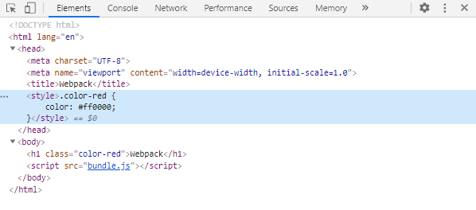
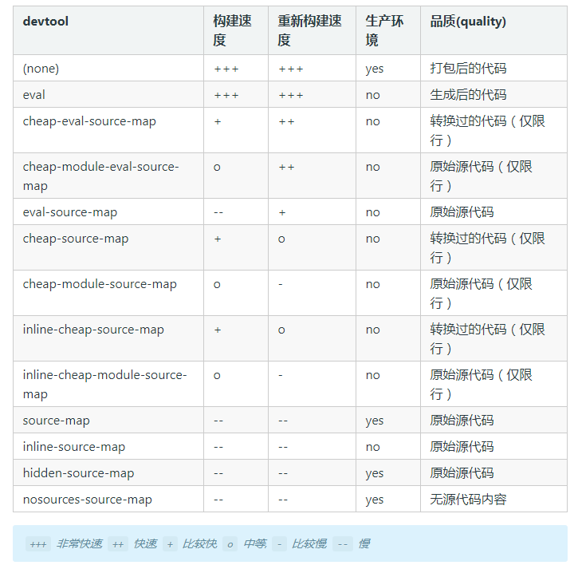
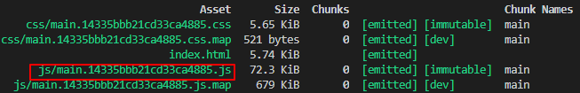
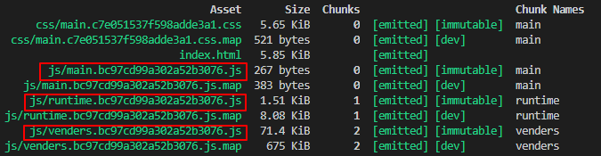

# Webpack

webpack 是一个现代 JavaScript 应用程序的静态模块打包器。

## 快速上手

### 安装

首先，创建项目并初始化 NPM（如果需要）：

```bash
npm init -y
```

本地安装 webpack（推荐）：

```bash
npm install --save-dev webpack
# 或指定版本
npm install --save-dev webpack@<version>
```

如果使用 webpack4+，还需要安装 CLI：

```
npm install --save-dev webpack-cli
```

### 配置

首先创建目录及文件。

创建 `index.html`：

```html
<!DOCTYPE html>
<html lang="en">
<head>
    <meta charset="UTF-8">
    <meta name="viewport" content="width=device-width, initial-scale=1.0">
    <title>Webpack</title>
</head>
<body>
    
    <script src="./src/index.js"></script>
</body>
</html>
```

创建 `src` 目录，并创建 `src/index.js` 文件：

```js
console.log('Hello Webpack')
``` 

创建配置文件 `webpack.config.js`：

```js
const path = require('path')

module.exports = {
    entry: './src/index.js',
    output: {
        filename: 'bundle.js',
        path: path.resolve(__dirname, 'dist')
    },
    mode: 'development'
}
```

`entry` 配置入口起点，`output` 配置输出路径以及输出文件名，`mode` 是 webpack4+ 针对目标环境的模式，可选值为 `development` 和 `production`。

### 运行

在 `packjage.json` 的 `scripts` 中配置运行命令：

```json
{
    "scripts": {
        "build": "webpack"
    }
}
```

运行命令：

```bash
npm run build
```

可以看到编译后生成了 `dist` 目录，以及 `dist/bundle.js` 文件。

替换 `index.html` 中的引用的脚本文件，并在浏览器中打开，打开调试器，正常运行。

```html
<!DOCTYPE html>
<html lang="en">
<head>
    <meta charset="UTF-8">
    <meta name="viewport" content="width=device-width, initial-scale=1.0">
    <title>Webpack</title>
</head>
<body>
    
    <script src="./dist/bundle.js"></script>
</body>
</html>
```

## 多入口文件（详解entry和output）

## modules 和 loader

webpack 通过 loader 可以支持各种语言和预处理器编写模块。loader 描述了 webpack 如何处理非 JavaScript 模块。

> 注意：使用 loader 解析文件之前，请先查看 plugins-HtmlWebpackPlugin 部分，并使用 `html-webpack-plugin` 插件。

### 加载css

安装 `style-loader` 和 `css-loader`：

```bash
npm install --save-dev style-loader css-loader
```

修改 `webpack.config.js`：

```js
const path = require('path')
const HtmlWebpackPlugin = require('html-webpack-plugin')

module.exports = {
    entry: './src/index.js',
    output: {
        filename: 'bundle.js',
        path: path.resolve(__dirname, 'dist')
    },
    module: {
        rules: [
            {
                test: /\.css$/,
                use: [
                    'style-loader',
                    'css-loader'
                ]
            }
        ]
    },
    plugins: [
        new HtmlWebpackPlugin({
            filename: 'index.html',
            template: 'index.html'
        })
    ],
    mode: 'development'
}
```

添加样式文件 `src/style.css`：

```css
.color-red {
    color: #ff0000;
}
```

修改 `index.html`：

```html
<body>
    <h1 class="color-red">Webpack</h1>
</body>
```

在 `src/index.js` 中导入样式：

```js
import './style.css'

console.log('Hello Webpack')
```

运行 `npm run build`，编译后打开 `dist/index.html`，打开后样式表被加载。如果打开调试器，能够看到在 `<head>` 标签里边注入了样式。



> 优化：使用 `MiniCssExtractPlugin` 分离 css 文件，参考后面 `plugins`

### sass/less

### images（url-loader/file-loader + html-loader）

#### url-loader/file-loader

`url-loader` 可以将图片资源转化为 base64 并引用，性能会优于直接引用图片。但是，当图片较大时，编码的性能下降，就需要改成引用图片，此时 `url-loader` 会调用 `file-loader` （需安装）加载图片。

详细用法参考官方文档：[https://webpack.js.org/loaders/url-loader/](https://webpack.js.org/loaders/url-loader/)

安装 `url-loader` 和 `file-loader`：

```bash
npm install --save-dev url-loader file-loader
```

修改 `webpack.config.js`：

```js
const path = require('path')
const HtmlWebpackPlugin = require('html-webpack-plugin')
const MiniCssExtractPlugin = require('mini-css-extract-plugin')

module.exports = {
    entry: './src/index.js',
    output: {
        filename: 'bundle.js',
        path: path.resolve(__dirname, 'dist')
    },
    module: {
        rules: [
            {
                test: /\.css$/,
                use: [
                    MiniCssExtractPlugin.loader,
                    'css-loader'
                ]
            },
            {
                test: /\.(png|svg|jpe?g|gif)$/,
                loader: 'url-loader',
                options: {
                    limit: 10240,
                    name: '[name].[hash:7].[ext]'
                }
            }
        ]
    },
    plugins: [
        new HtmlWebpackPlugin({
            filename: 'index.html',
            template: 'index.html'
        }),
        new MiniCssExtractPlugin()
    ],
    mode: 'development'
}
```

当图片不超过10240Bytes，即10KB时，图片会被转成base64，当超过10KB时，则会在构建目录生成文件名追加哈希值的图片。

修改 `index.html` 和 `rc/style.css`：

```html
<body>
    <h1 class="color-red">Webpack</h1>

    <div class="logo"></div>
</body>
```

```css
.color-red {
    color: #ff0000;
}

.logo {
    width: 50px;
    height: 50px;
    background-image: url('logo.png');
    background-size: cover;
    background-repeat: no-repeat;
    background-position: center;
}
```

编译后页面显示图片，在 `dist/main.css` 中，背景图片已被转换成base64（本例使用图片小于10KB）。

#### html-loader

使用 `url-loader` 或者 `file-loader`，只能处理 css 文件中的背景图片，或者 js文件中 `Image` 对象的 `src` 属性，对于 html 文件中 `` 的 `src` 属性引用的图片，需要使用 `html-loader`。

`html-loader`的详细用法参考官方文档：[https://webpack.js.org/loaders/html-loader/](https://webpack.js.org/loaders/html-loader/)

安装 `html-loader`（解析图片需要先安装 `url-loader` 或 `file-loader`）：

```bash
npm install --save-dev html-loader
```

修改 `webpack.config.js`：

```js
const path = require('path')
const HtmlWebpackPlugin = require('html-webpack-plugin')
const MiniCssExtractPlugin = require('mini-css-extract-plugin')

module.exports = {
    entry: './src/index.js',
    output: {
        filename: 'bundle.js',
        path: path.resolve(__dirname, 'dist')
    },
    module: {
        rules: [
            {
                test: /\.html$/,
                use: 'html-loader'
            },
            {
                test: /\.css$/,
                use: [
                    MiniCssExtractPlugin.loader,
                    'css-loader'
                ]
            },
            {
                test: /\.(png|svg|jpe?g|gif)$/,
                loader: 'url-loader',
                options: {
                    limit: 10240,
                    name: '[name].[hash:7].[ext]'
                }
            }
        ]
    },
    plugins: [
        new HtmlWebpackPlugin({
            filename: 'index.html',
            template: 'index.html'
        }),
        new MiniCssExtractPlugin()
    ],
    mode: 'development'
}
```

在 `index.html` 中使用 ``：

```html
<body>
    <h1 class="color-red">Webpack</h1>

    <div class="logo"></div>
    
</body>
```

编译后 `dist/index.html` 中的 `` 的 `src` 属性引用了 base64 格式的图片（不超过10KB），或者引用在 `dist` 中生成的图片。


### babel

Babel是一个JavaScript的编译器，可以将ES6的代码转化为浏览器支持的JavaScript代码（通常是ES5），从而在现有环境中运行。这就意味着，我们可以使用ES6编写程序，而不依赖于浏览器是否支持。

安装 babel：

```bash
npm install --save-dev babel-loader @babel/core @babel/preset-env
```

修改 `webpack.config.js`：

```js
const HtmlWebpackPlugin = require('html-webpack-plugin')

module.exports = {
    // ...
    module: {
        rules: [
            // ...
            {
                test: /\.js$/,
                exclude: /(node_modules|bower_components)/,    // 排除node_modules目录
                use: {
                    loader: 'babel-loader'
                }
            }
        ]
    },
    plugins: [
        new HtmlWebpackPlugin({
            template: 'index.html'
        })
    ]
}
```
创建 `.babelrc` 或者 `.bable.config.json`：

```json
{
    "presets": [
        [
            "@babel/env",
            {
                "debug": true,
                "targets": "> 1%, last 2 versions, not ie <= 8",
                "useBuiltIns": "usage",
                "corejs": 3
            }
        ]
    ]
}
```

babel 的详细用法参考后面的 Babel 文档或者官方文档：[https://www.babeljs.cn/](https://www.babeljs.cn/)

### eslint

1. 安装相关的包

```sh
npm install eslint eslint-loader eslint-friendly-formatter --save-dev
```

2. 修改 webpack 配置文件 `webpack.config.js`：

```js
const path = require('path')

module.exports = {
    module: {
        rules: [
            {
                test: /\.js$/,
                loader: 'eslint-loader',
                enforce: 'pre',
                include: path.resolve(__dirname, 'src'),
                options: {
                    formatter: require('eslint-friendly-formatter')
                }
            }
        ]
    }
}
```

3. 创建 `.eslintrc.js` 配置文件：

```js
module.exports = {
    root: true,
    parserOptions: {
        parser: 'babel-eslint',
        sourceType: 'module',
        ecmaVersion: 11
    },
    env: {
        browser: true
    },
    extends: ['eslint:recommended'],
    rules: {
        
    }
}
```

如果需要使用流行风格指南 `standard`，需要安装以下包：

```sh
npm install --save-dev "eslint-config-standard eslint-plugin-import eslint-plugin-node eslint-plugin-promise eslint-plugin-standard
```

然后修改 `.eslintrc.js` 的 `extends` 选项：

```js
module.exports = {
    // ...
    extends: ['standard'],
}
```

4. 创建 `.eslintignore` 文件，部分路径和文件不启用 eslint 检查：

```sh
/dist/
/*.js
```

> 根目录下的配置相关的文件夹也应添加到该文件中

### vue

## plugins

插件是 webpack 的支柱功能，用于解决 loader 无法实现的其他事。

### HtmlWebpackPlugin

`HtmlWebpackPlugin` 用于打包 html 文件。

安装：

```bash
npm install --save-dev html-webpack-plugin
```

修改 `webpack.config.js`：

```js
const path = require('path')
const HtmlWebpackPlugin = require('html-webpack-plugin')

module.exports = {
    // ...
    plugins: [
        new HtmlWebpackPlugin({
            filename: 'index.html',    // 编译后输出的文件名
            template: 'index.html'     // 用于编译的模板文件
        })
    ]
}
```

修改 `index.html`：

```html
<body>
    <h1>Webpack</h1>
</body>
```

添加了标题，并且去掉了原先脚本的引用，因为编译后会自动在 `<body>` 标签的底部注入脚本。

运行 `npm run build`，在 `dist` 目录下生成了 `index.html`，打开后显示“Webpack”标题。

### MiniCssExtractPlugin

之前使用 `style-loader` 和 `css-loader`加载 css 文件的方法， 将 css 文件内嵌到 `bundle.js` 中，只有加载脚本文件的时候，才会将样式表插入到页面中。这就意味着，当样式表或者脚本文件较大时，需要花时间等待脚本文件下载完，样式表才会生效。优化的办法是使用 `MiniCssExtractPlugin`， 分离 css 文件和 js 文件，让浏览器可以并发下载资源，不过也会增加请求数量（webpack3 使用 `ExtractTextWebpackPlugin`分离 css 文件，webpack4 以后使用 `MiniCssExtractPlugin` ）。

> `MiniCssExtractPlugin` 一般只用于生产环境，开发环境一般会启用模块热替换（HMR），不需要担心打包后文件过大的问题。除此之外，在 loader 链中也不应该有 style-loader。

参考文档：[https://webpack.js.org/plugins/mini-css-extract-plugin](https://webpack.js.org/plugins/mini-css-extract-plugin)

安装 `mini-css-extract-plugin`：

```bash
npm install --save-dev mini-css-extract-plugin
```

修改 `webpack.config.js`：

```js
const HtmlWebpackPlugin = require('html-webpack-plugin')
const MiniCssExtractPlugin = require('mini-css-extract-plugin')

module.exports = {
    // ...
    module: {
        rules: [
            {
                test: /\.css$/,
                use: [
                    MiniCssExtractPlugin.loader,
                    'css-loader'
                ]
            },
            {
                test: /\.(png|svg|jpe?g|gif)$/,
                loader: 'url-loader',
                options: {
                    limit: 10240,
                    name: '[name].[hash:7].[ext]'
                }
            }
        ]
    },
    plugins: [
        new HtmlWebpackPlugin({
            filename: 'index.html',
            template: 'index.html'
        }),
        new MiniCssExtractPlugin()
    ],
    mode: 'development'
}
```

运行 `npm run build`，在 `dist`目录下生成 `main.css`，`dist/index.html` 文件在 `<head>` 标签中以 `<link>` 引入了样式表。

## 开发环境和生产环境

开发环境（development）和生产环境（production）的构建目标差异很大。在开发环境中，我们需要具有强大的、具有实时重新加载（live reloading）或热模块替换（hot module replacement）能力的 source map 和 localhost server。而在生产环境中，我们的目标则转向于关注更小的 bundle，更轻量的 source map，以及更优化的资源，以改善加载时间。由于要遵循逻辑分离，我们通常建议为每个环境编写彼此独立的 webpack 配置。

以上涉及的概念会在接下来逐个详解。

### 区分开发环境和生产环境

删除之前的 `webpack.config.js`，然后安装 `webpack-merge`：

```bash
npm install --save-dev webpack-merge
```

`webpack-merge` 用于提取公用的 webpack 配置内容。


为了规范项目的目录，做，如下处理，`src/css` 存放原始 css 文件，`src/js` 存放原始 js 文件，`src/img` 存放静态图片，相关资源的引入和打包输出，也作出相应修改。

创建通用 webpack 配置文件 `webpack.common.js`：

```js
const path = require('path')
const MiniCssExtractPlugin = require('mini-css-extract-plugin')

module.exports = {
    entry: './src/js/index.js',
    output: {
        filename: 'js/[name].[hash:7].js',
        path: path.resolve(__dirname, 'dist')
    },
    module: {
        rules: [
            {
                test: /\.html$/,
                use: 'html-loader'
            },
            {
                test: /\.css$/,
                use: [
                    MiniCssExtractPlugin.loader,
                    'css-loader'
                ]
            },
            {
                test: /\.(png|svg|jpe?g|gif)$/,
                loaders: 'url-loader',
                options: {
                    limit: 10240,
                    name: 'img/[name].[hash:7].[ext]'
                }
            }
        ]
    },
    plugins: [
        new MiniCssExtractPlugin({
            filename: 'css/[name].[hash:7].css'
        })
    ]
}
```

通用配置包括入口文件，输出配置，加载 css，加载图片等。


创建开发环境配置文件 `webpack.dev.js`：

```js
const { merge } = require('webpack-merge')
const common = require('./webpack.common.js')
const HtmlWebpackPlugin = require('html-webpack-plugin')

module.exports = merge(common, {
    plugins: [
        new HtmlWebpackPlugin({
            filename: 'index.html',
            template: 'index.html'
        })
    ],
    mode: 'development'
})
```

创建生产环境配置文件 `webpack.prod.js`：

```js
const { merge } = require('webpack-merge')
const common = require('./webpack.common.js')
const HtmlWebpackPlugin = require('html-webpack-plugin')

module.exports = merge(common, {
    plugins: [
        new HtmlWebpackPlugin({
            filename: 'index.html',
            template: 'index.html'
        })
    ],
    mode: 'production'
})
```

### mode

`'production' | 'development' | none`， 默认为 `production`

webpack4 以后，可以通过 `mode` 来指定目标环境是开发环境，还是生产环境。`mode` 属性可以指定 `process.env.NODE_ENV`，这个值之前需要通过 `DefinePlugin` 来定义，许多 `library` 会根据这个变量的不同，来引用不同的代码。除此之外，配置 `mode`，webpack 还会根据目标环境自动添加和设置一些插件。

> mode 启用的插件

### web 服务器以及 NPM 命令

在开发环境中，每次修改代码，都要手动运行 `npm run build` 命令编译代码是比较麻烦的，为此可以配置 web 服务器，在代码修改时自动编译。

安装 `webpack-dev-server`：

```bash
npm install --save-dev webpack-dev-server
```

修改开发环境的配置文件 `webpack.dev.js`，告诉开发服务器在哪里查找文件：

```js
const { merge } = require('webpack-merge')
const common = require('./webpack.common.js')
const HtmlWebpackPlugin = require('html-webpack-plugin')

module.exports = merge(common, {
    plugins: [
        new HtmlWebpackPlugin({
            filename: 'index.html',
            template: 'index.html'
        })
    ],
    devServer: {
        contentBase: './dist'
    },
    mode: 'production'
})
```

更多 `webpack-dev-server` 的配置参考官方文档：[https://webpack.js.org/configuration/dev-server/](https://webpack.js.org/configuration/dev-server/)

修改 `package.json`，为开发环境和生产环境配置不同的 NPM 命令：
```json
"scripts": {
    "dev": "webpack-dev-server --open --config webpack.dev.js",
    "build": "webpack --config webpack.prod.js"
},
```

* 使用 `npm run dev` 命令启用开发环境，启用 `webpack-dev-server`，编译后会自动在浏览器中打开，再次修改代码并保存，浏览器会自动更新。
* 使用 `npm run build` 命令构建生产环境，会创建 `dist` 目录并编译到此目录，上线前交付此目录即可。


### source-map(devtool)

当 webpack 打包源代码时，可能会很难追踪到错误和警告在源代码中的原始位置。为了更容易地追踪错误和警告，JavaScript 提供了 source map 功能，将编译后的代码映射回原始源代码。webpack 通过 `devtool` 属性来配置不同的 `source-map` 值。



具体的 `source-map` 值可参考官方文档：[https://webpack.js.org/configuration/devtool/](https://webpack.js.org/configuration/devtool/)

使用不同的 `source-map` 值，代码的构建速度和代码映射是不一样的。对于开发环境，通常希望以增加编译后包的体积为代价获取更快速的 source map，但是对于生产环境，则希望分离和压缩模块，获得精确的 source map。

修改开发环境配置文件 `webpack.dev.js`：

```js
const { merge } = require('webpack-merge')
const common = require('./webpack.common.js')
const HtmlWebpackPlugin = require('html-webpack-plugin')

module.exports = merge(common, {
    plugins: [
        new HtmlWebpackPlugin({
            filename: 'index.html',
            template: 'index.html'
        })
    ],
    devtool: 'cheap-module-eval-source-map',
    devServer: {
        contentBase: './dist'
    },
    mode: 'development'
})
```

修改生产环境配置文件 `webpack.prod.js`：

```js
const { merge } = require('webpack-merge')
const common = require('./webpack.common.js')
const HtmlWebpackPlugin = require('html-webpack-plugin')

module.exports = merge(common, {
    plugins: [
        new HtmlWebpackPlugin({
            filename: 'index.html',
            template: 'index.html'
        })
    ],
    devtool: 'source-map',
    mode: 'production'
})
```

### 编译 CSS

* 开发环境：使用 `css-loader` 和 `style-loader` 编译 CSS。

* 生产环境：使用 `css-loader` 和 `MiniCssExtractPlugin` 编译CSS。`MiniCssExtractPlugin` 的详细用法参考 `plugins`。

> `MiniCssExtractPlugin` 一般只用于生产环境，开发环境一般会启用模块热替换（HMR），不需要担心打包后文件过大的问题。除此之外，在 loader 链中，`style-loader` 和 `MiniCssExtractPlugin` 不能同时使用。

修改通用配置文件 `webpack.common.js`：

```js
module.exports = {
    module: {
        rules: [
            {
                test: /\.css$/,
                use: [
                    'style-loader',    // MiniCssExtractPlugin.loader -> 'style-loader'
                    'css-loader'
                ]
            }
        ]
    },
    plugins: [
        // 移除 MiniCssExtractPlugin 插件
        // new MiniCssExtractPlugin({
        //     filename: 'css/[name].[hash].css'
        // })
    ]
}
```

修改开发环境配置文件 `webpack.dev.js`：

```js
const { merge } = require('webpack-merge')
const common = require('./webpack.common.js')

module.exports = merge(common, {
    module: {
        // 添加 css loader
        rules: [
            {
                test: /\.css$/,
                use: [
                    'style-loader',
                    'css-loader'
                ]
            }
        ]
    },
    mode: 'development'
})
```

修改生产环境配置文件 `webpack.prod.js`：

```js
const { merge } = require('webpack-merge')
const common = require('./webpack.common.js')

module.exports = merge(common, {
    module: {
        // 使用 MiniCssExtractPlugin.loader
        rules: [
            {
                test: /\.css$/,
                use: [
                    MiniCssExtractPlugin.loader,
                    'css-loader'
                ]
            }
        ]
    },
    plugins: [
        // 添加 MiniCssExtractPlugin
        new MiniCssExtractPlugin({
            filename: 'css/[name].[hash].css'
        })
    ],
    mode: 'production'
})
```

### 清理 dist 文件夹（生产环境）

在构建生产环境时，会在 `dist` 目录下生成编译后的文件。假如我们删除 `src` 目录下的某些文件，再次编译后之前的代码仍会遗留在 `dist` 文件夹中，导致 `dist` 文件夹相当杂乱。比较推荐的做法是使用 `clean-webpack-plugin` 插件，每次构建前清理 `dist` 文件夹。

安装 `clean-webpack-plugin` 插件：

```bash
npm install --save-dev clean-webpack-plugin
```

修改生产环境配置文件 `webpack.prod.js`：

```js
const { merge } = require('webpack-merge')
const common = require('./webpack.common.js')
const HtmlWebpackPlugin = require('html-webpack-plugin')
const { CleanWebpackPlugin } = require('clean-webpack-plugin')

module.exports = merge(common, {
    plugins: [
        new CleanWebpackPlugin(),
        new HtmlWebpackPlugin({
            filename: 'index.html',
            template: 'index.html'
        })
    ],
    devtool: 'source-map',
    mode: 'production'
})
```

`clean-webpack-plugin` 的详细配置参考：[https://www.npmjs.com/package/clean-webpack-plugin](https://www.npmjs.com/package/clean-webpack-plugin)。

### 模块热替换（HMR）（开发环境）

在构建开发环境时，模块热替换允许在运行时更新各种模块，而无需进行完全刷新。

修改 开发环境配置文件 `webpack.dev.js`：

```js
const { merge } = require('webpack-merge')
const common = require('./webpack.common.js')
const webpack = require('webpack')

module.exports = merge(common, {
    plugins: [
        new webpack.HotModuleReplacementPlugin()    // 引入 HMR 插件
    ],
    devServer: {
        contentBase: './dist',
        hot: true    // webpack-dev-server 的 hot 选项设置为true
    },
    mode: 'development'
})
```

### 打包分析器（webpack-bundle-analyzer）（生产环境）

`webpack-bundle-analyzer` 插件可以将打包后的结果以矩形树图的方式进行可视化显示，方便我们进行模块分析和性能优化。

详细用法参考：[https://github.com/webpack-contrib/webpack-bundle-analyzer](https://github.com/webpack-contrib/webpack-bundle-analyzer)


1. 安装插件

```sh
npm install webpack-bundle-analyzer --save-dev
```

2. 在生产环境配置文件 `webpack.prod.js` 中引入插件，为此，需要区分配置定义和导出

```js
const { merge } = require('webpack-merge')
const common = require('./webpack.common.js')

// 抽离配置定义
const webpackConfig = merge(common, {
    // ...
    mode: 'production'
})

// npm run build --report（按需启用，当指定 --report 参数时启用插件）
if (process.env.npm_config_report) {
    const { BundleAnalyzerPlugin } = require('webpack-bundle-analyzer')
    webpackConfig.plugins.push(new BundleAnalyzerPlugin())
}

// 导出
module.exports = webpackConfig
```

3.运行编译命令

```sh
npm run build --report
```

编译后自动打开分析页面，可以直观看到各个模块打包后的相对大小，我们就可以有针对性地对模块进行优化。除此之外，还能看到各个模块代码的原始大小（stat）、编译后的大小（parsed）以及压缩后的大小（Gzipped）。

## 浏览器缓存

浏览器具有缓存技术，会将访问过的网页资源（例如 css 文件、js 文件以及图片等）缓存到本地，下次访问网页的相同资源时，就会使用缓存，减少网络请求，加快页面加载速度。缓存技术的存在，对提升网页加载性能是有利的，但是对我们更新代码就不那么友好了。我们更新了代码，由于浏览器缓存，用户浏览到的仍然是旧版本的页面。

### 文件名哈希值

每次更新代码时，通过对打包的文件名追加 `hash`，使得文件名与之前不一致，浏览器就不会因为缓存而忽略更新。

在 webpack 中，有三种类型的 `hash`，分别是 `[hash]`、`[chunkhash]` 和 `[contenthash]`

* `[hash]`

`[hash]` 是项目级别的，即同一个项目中的所有文件共用一个哈希值，这就产生一个问题，假如只修改某一个文件，所有文件名的哈希值都会更新，每次更新后，浏览器缓存都会失效，用户就要访问重新所有资源，网页的性能因此下降。


```js
// webpack.common.js
const path = require('path')

module.exports = {
    entry: './src/js/index.js',
    output: {
        filename: 'js/[name].[hash].js',    // hash
        path: path.resolve(__dirname, 'dist')
    },
    module: {
        rules: [
            {
                test: /\.(png|svg|jpe?g|gif)$/,
                loaders: 'url-loader',
                options: {
                    limit: 10240,
                    name: 'img/[name].[hash].[ext]'    // hash
                }
            }
        ]
    }
}
```

```js
// webpack.prod.js
const { merge } = require('webpack-merge')
const common = require('./webpack.common.js')

module.exports = merge(common, {
    plugins: [
        new MiniCssExtractPlugin({
            filename: 'css/[name].[hash].css'    // hash
        })
    ],
    mode: 'production'
})
```

* `[chunkhash]` 根据不同的入口文件进行依赖文件解析、构建对应的 chunk，生成对应的哈希值。这样不同的文件就会生成不同的哈希值，只更新一个文件，不会影响其他文件的缓存（这种说法并不准确，下面会说明）。

```js
// webpack.prod.js
const { merge } = require('webpack-merge')
const common = require('./webpack.common.js')

module.exports = merge(common, {
    plugins: [
        new MiniCssExtractPlugin({
            filename: 'css/[name].[chunkhash].css'    // chunkhash
        })
    ],
    mode: 'production'
})
```

> 注意： 在 `webpack.common.js` 中，`output.filename` 仍然保留 `[hash]`，这是因为开发环境中的 `HotModuleReplacementPlugin` 插件会和 `chunkhash` 冲突。除此之外，`[chunkhash]` 只适用于 js 和 css，对图片不生效，所以 `url-loader` 中也保留 `[hash]`

`[chunkhash]` 仍然有个问题，如果将 css 文件导入到 js 文件中，修改 js 文件，css 文件的哈希值也都会变化，没有起到缓存的作用。

* `[contenthash]`

`[contenthash]` 是针对文件内容级别的，只有当前模块的内容变了，哈希值才会改变。

综合例子：

```js
// webpack.common.js
const path = require('path')

module.exports = {
    entry: './src/js/index.js',
    output: {
        filename: 'js/[name].[hash].js',    // hash
        path: path.resolve(__dirname, 'dist')
    },
    module: {
        rules: [
            {
                test: /\.(png|svg|jpe?g|gif)$/,
                loaders: 'url-loader',
                options: {
                    limit: 10240,
                    name: 'img/[name].[hash].[ext]'    // hash
                }
            }
        ]
    }
}
```

```js
// webpack.prod.js
const { merge } = require('webpack-merge')
const common = require('./webpack.common.js')

module.exports = merge(common, {
    plugins: [
        new MiniCssExtractPlugin({
            filename: 'css/[name].[contenthash].css'    // contenthash
        })
    ],
    mode: 'production'
})
```

针对生产环境中的 `MiniCssExtractPlugin` 插件，编译 css 代码时，使用 `[contenthash]`。这样，修改某个 js 文件，只改变对应模块的哈希值，该 js 文件引入的 css 文件的哈希值不会改变。

### 提取模板/代码分离（生产环境）

通常我们的项目中会包含三种类型的代码：

* 自己或者团队编写的业务代码

* 第三方库，例如 lodash 和 vue

* webpack 的 runtime 和 manifest，管理所有模块的交互

#### Runtime 
> runtime，以及伴随的 manifest 数据，主要是指：在浏览器运行时，webpack 用来连接模块化的应用程序的所有代码。runtime 包含：在模块交互时，连接模块所需的加载和解析逻辑。包括浏览器中的已加载模块的连接，以及懒加载模块的执行逻辑。

#### Manifest
> 当编译器(compiler)开始执行、解析和映射应用程序时，它会保留所有模块的详细要点。这个数据集合称为 "Manifest"，当完成打包并发送到浏览器时，会在运行时通过 Manifest 来解析和加载模块。无论你选择哪种模块语法，那些 import 或 require 语句现在都已经转换为 `__webpack_require__` 方法，此方法指向模块标识符(module identifier)。通过使用 manifest 中的数据，runtime 将能够查询模块标识符，检索出背后对应的模块。

在实际开发中，项目中的第三方库基本是不会变化的。然而，webpack 默认会把业务代码，manifest 和 第三方库代码打包到同一个文件中，我们修改业务代码的时候，整个文件重新编译，缓存也会失效，浏览器需要重新下载整个文件，性能比较低。因此，我们一般会把 manifest 和 第三方库提取到单独的文件中。

#### 代码分离之前

为了测试，首先，安装和引入第三方组件库 `lodash`：

```sh
npm install --save-dev lodash
```

```js
// src/js/index.js
import '../css/style.css'
import { indexOf } from 'lodash'

console.log('Hello Webpack')
console.log(indexOf([1, 2, 3], 2))
```

运行 `npm run build` 命令，可以看到打包信息：



js 代码都打包到 `main.xxx.js` 一个文件中，并且 `Chunk Names` 只有 `main`。

#### 代码分离

首先，指定 `optimization.runtimeChunk` 为 `'single'`，提取 `manifest` 模板：

```js
// webpack.prod.js
const { merge } = require('webpack-merge')
const common = require('./webpack.common.js')

const webpackConfig = merge(common, {
    optimization: {
        runtimeChunk: 'single'
    },
    mode: 'production'
})

module.exports = webpackConfig
```

然后，配置 `optimization.splitChunks.cacheGroups` 分离第三方库代码：

```js
// webpack.prod.js
const { merge } = require('webpack-merge')
const common = require('./webpack.common.js')

const webpackConfig = merge(common, {
    optimization: {
        runtimeChunk: 'single',
        splitChunks: {
            cacheGroups: {
                vender: {
                    test: /[\\/]node_modules[\\/]/,
                    name: 'venders',
                    chunks: 'all'
                }
            }
        }
    },
    mode: 'production'
})

module.exports = webpackConfig
```

运行 `npm run build`。



可以看到，打包后的 js 代码包含 `main.xxx.js`（业务代码）、`runtime.xxx.js`（runtime 代码）和 `venders.xxx.js`（第三方库代码）， `Chunk Names` 也包含了 `main`、`runtime` 和 `venders`，说明已经实现了代码分离。

> webpack4 以后，使用 `optimization.splitChunks` 来分离代码，webpack4 以前，使用 `CommonsChunkPlugin` 插件来实现，参考 [https://www.webpackjs.com/guides/caching/](https://www.webpackjs.com/guides/caching/)